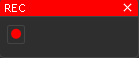

# Image
A window showing current trail render. In its menu it allows you to save image to the filesystem or start recording.

The recording is not done in real time. Output video is 60 fps in high quality, so it will most likely take up a lot of space.

