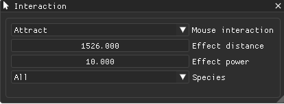

# Interaction

The user is interacting with the simulation when hovering over rendered trail and pressing left mouse button.

Available modes for simulation interaction are:
  * None - The simulation doesn't react to mouse cursor.
  * Attract - Particles are attracted to the cursor and stay there.
  * Repel - Particles are pushed away from the cursor.
  * Draw - Trail is drawn at the position of the cursor.
  * Erase - Trail is removed at the position of the cursor.

Additional controls:
  * Effect distance - Radius of the area affected by the cursor.
  * Effect power - multiplier to applied forces or values.
  * Effect falloff - Used for Draw/Erase. Makes the effect weaker further away from cursor.
  * Species - Species affected by the interaction. Either all can be affected or just a selected one.