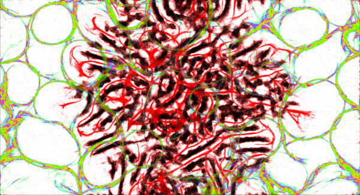

# Physarum simulation

This project is based on [https://uwe-repository.worktribe.com/output/980579](https://uwe-repository.worktribe.com/output/980579). Another nice description of how this simulation work is over here [https://sagejenson.com/physarum](https://sagejenson.com/physarum). (Click links to copy them to your clipboard).

All of the UI elements have tooltips/hints which mention what they do, but you need to read through this help to figure out how they affect the simulation (or just experiment and try it out yourself :)). This information can be found in the **Controls** category on the left.

If you want to look at the unoptimized & messy code that makes this run, you can check it out at [https://github.com/PetrFlajsingr/PhysarumSim](https://github.com/PetrFlajsingr/PhysarumSim).

If you come across any bugs or crashes, please let me know in the issues on github.