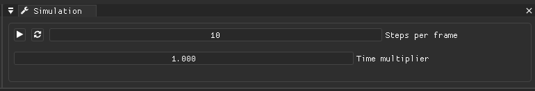

# Simulation speed/time controls

UI elements in order:
  * Play button - Resumes/pauses the simulation.
  * Refresh button - reloads the simulation by restarting the particle positions and reloading their settings. 
  * Steps per frame - amount of simulation steps per render frame. This does not affect accuracy of the simulation, but it greatly affects performance.
  * Time multiplier - multiplier of time delta within the simulation. This speeds up the simulation without performance cost, but it can have a negative effect on accuracy.