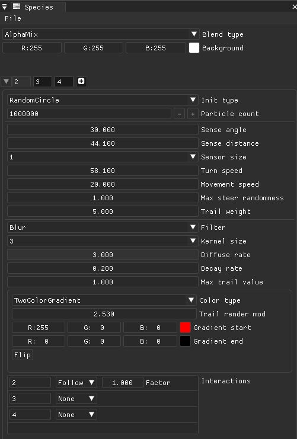

# Species

Panel allowing to add/remove particle species from the simulation, modify their rendering and their interactions.

Description of elements:
  * Menu
    * File - Species configurations can be saved/loaded from file system.
  * Blend type - Sets the way trail values of different species are combined
    * AlphaBlend - Values are alpha blended based on their trail value, leads to the most 'realistic' result.
    * Additive - Values are added together, leads to lighter areas on overlap
    * Layered - Values are rendered in the order the species are defined. There is no blending in this mode.
  * Background - Color of the render texture background.
  * Species tab bar - List of species and their settings. You can click (x) button on species' tab to remove it or click the + button to add a new one. If a species is removed or added you need to restart the simulation to apply this change.
    * Init type - Initial distribution of particles on the screen.
    * Particle count - Count of particles in this species.
    * Sense angle - Angle of the particle's sensor relative to its current direction.
    * Sense distance - Distance of the particle's sensor from its current position.
    * Sensor size - Size of the sensor's kernel. 
    * Turn speed - Speed at which the particle turns when it senses higher values in side directions.
    * Movement speed - Amount of pixels traveled per time unit.
    * Max steer randomness - Effect of randomness on turning. Lower value leads to more predictable patterns.
    * Trail weight - Amount of trail deposited by a particle in each step.
    * Filter - Type of filter used in diffusion step of the simulation.
    * Kernel size - Size of filter's kernel. Only usable for blur.
    * Decay rate - Speed of trail decay compared to diffuse filtering.
    * Max trail value - Maximum allowed trail value per pixel.
    * Color type - Type of color mapping for species' trail.
    * Interactions - Options for inter-species interactions. Selected species can either avoid others, follow or ignore them.